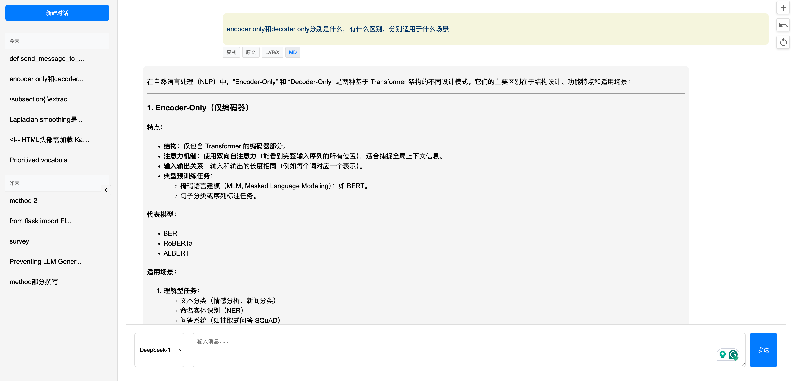

# deepseek-R1 本地网页对话

一个基于 Flask 和 云API 的 deepseek-r1 聊天界面，支持 Markdown 和 LaTeX 渲染。
<!--  -->
deepseek官网实在太太太卡了…

## 功能特点

- 支持多个 API key 切换
- Markdown 和 LaTeX 渲染
- 历史对话保存和加载
- 实时流式响应
- 支持代码高亮
- 支持数学公式

## 申请API key

可以申请 [潞晨云](https://cloud.luchentech.com/account/signup?invitation_code=invite_gkxi7yamJEauvSyEjZH2ZJ) 的API key。

登录进去选择模型市场，再创建API key即可。

我的邀请码： invite_gkxi7yamJEauvSyEjZH2ZJ

目前还是免费的。
可以用不同账号申请多个API key，然后切换使用。

## 配置

1. 复制配置文件模板：
```bash
cp config.json.example config.json
```

2. 在 `config.json` 中配置你的 API keys：
```json
{
    "api_keys": {
        "key1": {
            "name": "DeepSeek-1",
            "key": "your-api-key-1"
        },
        "key2": {
            "name": "DeepSeek-2",
            "key": "your-api-key-2"
        }
    }
}
```

## 项目结构

- `app.py`: Flask 应用主文件
- `templates/index.html`: 前端界面模板
- `static/`: 静态文件目录
- `config.json`: API keys 配置文件
- `chat_history.json`: 对话历史记录文件

## 安装依赖

```bash
pip install flask requests
```

## 运行

```bash
python app.py
```
或者后台运行
```bash
nohup /opt/miniconda3/bin/python -u app.py > output.log 2>&1 &
```

## 使用说明

1. 在浏览器中访问 `http://localhost:5000`
2. 从下拉菜单选择要使用的 API key
3. 输入消息并发送
4. 支持 Markdown 和 LaTeX 格式

## 鸣谢
感谢[潞晨云](https://cloud.luchentech.com/account/signup?invitation_code=invite_gkxi7yamJEauvSyEjZH2ZJ)提供的API。